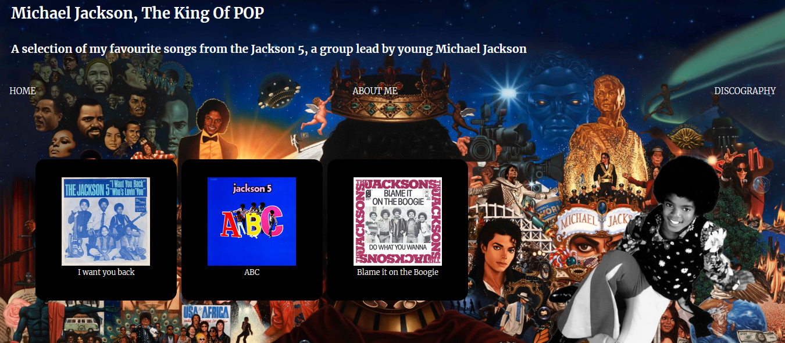

#  Présentation du site

Ce site est un blog personnel qui présente plusieurs oeuvres de la discographie de Michael Jackson. Le site est en Anglais car j'estimais mieux exprimer les opinions représentés  dans chacune des pages dans cette langue.

# Aperçu du site internet

# Description du Contenu Principal

### Page d'Accueil :
Cette page est plutôt simple et sert d'introduction au contenu du site internet
### Page "à propos" :
Une page qui me présente moi et les raisons pour lesquelles j'ai décidé de créer ce site
### Page "Discographie" :
Dans cette page on retrouve une liste de mes albums préférés de Michael Jackson. Chacun des éléments de la liste redirige vers une avis relayant mon avis sur l'album en question.

### Page "Enfance" :
Dans cette page on retrouve 3 de mes chansons préféré datant de l'enfance de Michael Jackson avec les Jackson 5. En cliquant sur l'une des images on est redirigé vers les descriptions de chacun des titres.
# Langages Utilisés :
- HTML
- CSS

# "Features" Implémentées :
- Responsives configuré pour les machines mobiles
- Animations CSS simples pour le header
- Loader/Ecran d'accueil au démarage du site

# Lien vers le Github Pages
- [Cliquez ici](https://gylbtwnbrackets.github.io/Mon-site/)

